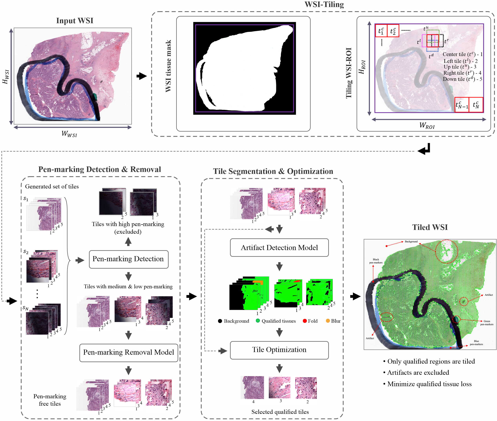
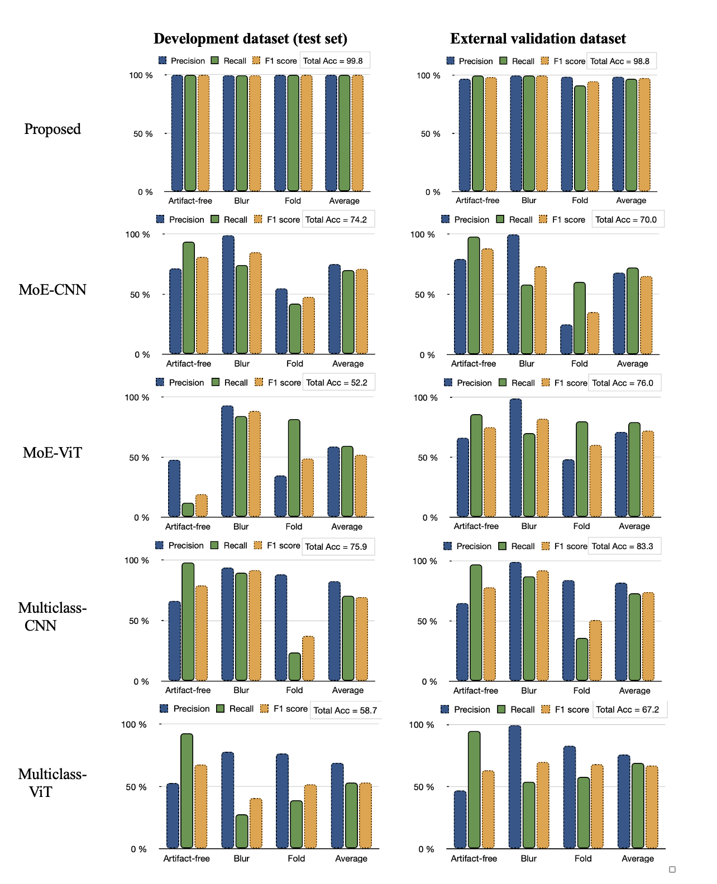
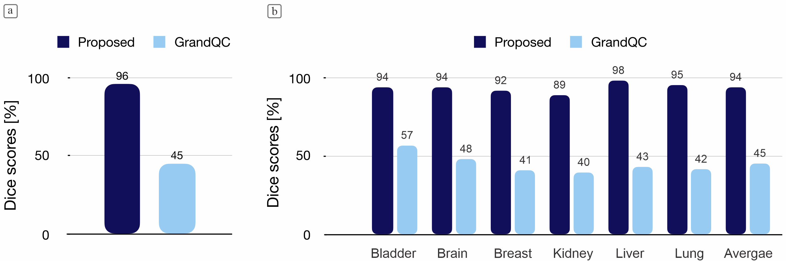
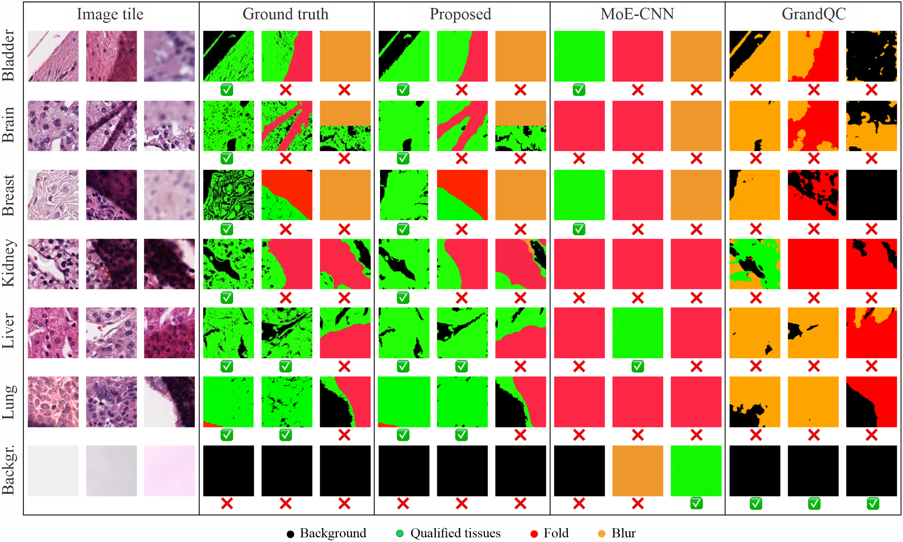
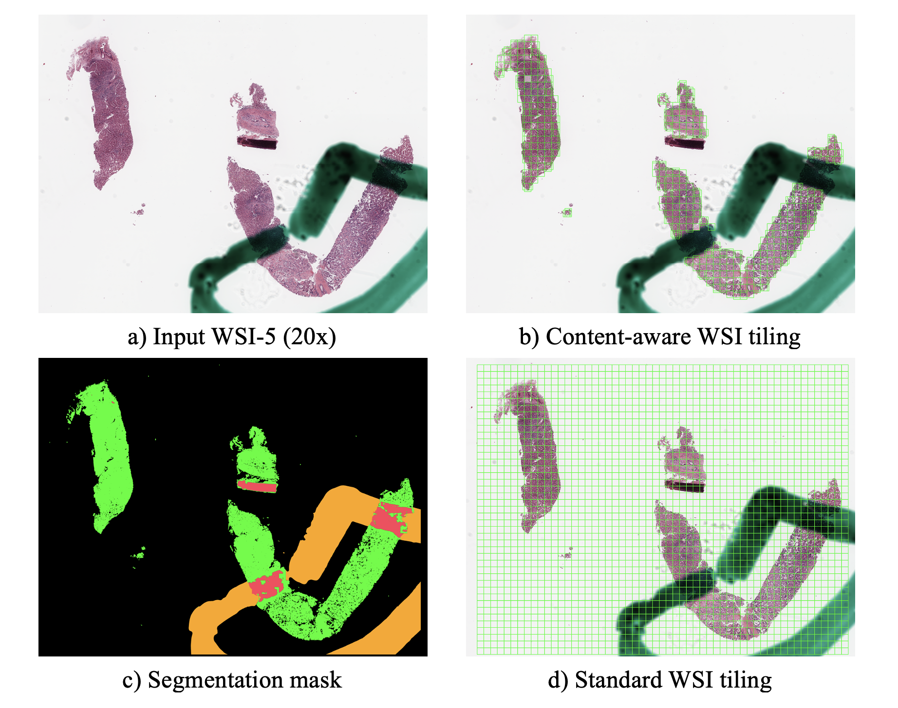

# Abstract

 Tiling (or patching) histology Whole Slide Images (WSIs) is a required initial step in the development of deep learning (DL) models. Gigapixel-scale WSIs must be divided into smaller, manageable image tiles. Standard WSI tiling techniques often exclude diagnostically important tissue regions or include regions with artifacts such as folds, blurs, and pen-markings, which can significantly degrade DL model performance and analysis. This paper introduces WSI-SmartTiling, a fully automated, deep learning-based, content-aware WSI tiling pipeline designed to include maximal information content from WSI. A supervised DL model for artifact detection was developed using pixel-based semantic segmentation at high magnification (20x and 40x) to classify WSI regions as either artifacts or qualified tissue. The model was trained on a diverse dataset and validated using both internal and external datasets. Quantitative and qualitative evaluations demonstrated its superiority, outperforming state-of-the-art methods with accuracy, precision, recall, and F1 scores exceeding 95% across all artifact types, along with Dice scores above 94%. In addition, WSI-SmartTiling integrates a generative adversarial network model to reconstruct tissue regions obscured by pen-markings in various colors, ensuring relevant valuable areas are preserved. Lastly, while excluding artifacts, the pipeline efficiently tiles qualified tissue regions with minimum tissue loss.
In conclusion, this high-resolution preprocessing pipeline can significantly improve pathology WSI-based feature extraction and DL-based classification by minimizing tissue loss and providing high-quality – artifact-free – tissue tiles. 

# Setting Up the Pipeline:

1. System requirements:
- Ubuntu 20.04 or 22.04
- CUDA version: 12.2
- Python version: 3.9 (using conda environments)
- Anaconda version 23.7.4
2. Steps to Set Up the Pipeline:
- Download the pipeline to your Desktop
- Navigate to the downloaded pipeline folder
- Right-click within the pipeline folder and select Open Terminal
- Create a conda environment:
`conda create -n WSISmartTiling python=3.9`

- Activate the environment:
  `conda activate WSISmartTiling`

- Install required packages:
  `pip install -r requirements.txt`

# Datasets:

- Contact the corresponding author to access the datasets described in the paper
- The datasets (only tiles and segmentation masks) are available for research purposes only

# Pretrained Weights:

- Download the pretrained weights from this link: [Weights](https://drive.google.com/drive/folders/1_p6jBo9DkOvN_YAvBikP73VcYjp76cXr?usp=share_link)
- Place the artifact detection weights in the `pretrained_ckpt` folder, and the pen-marking detection and removal weights in the `/Ink_Removal/pre-trained` folder

# Inference:

 The pipeline starts by identifying the WSI tissue region and dividing it into smaller image tiles (e.g., 270x270). Pen-marking detection is then applied to categorize the tiles into two classes: those with high pen-marking (which are discarded) and those with medium and low pen-marking. Tiles with medium and low pen-marking undergo a pen-marking removal process, resulting in clean image tiles. Next, the clean image tiles are fed into the proposed artifact detection model to identify artifacts, followed by an optimization technique to select the best tiles—those with minimal artifacts and background and maximum qualified tissue. Finally, the WSI is reconstructed by combining the selected tiles to generate the final output. Additionally, the model generates a segmentation for the entire WSI and also provides statistics on the tile segmentations. 

- Place your Whole Slide Image (WSI) into the `test_wsi` folder
- The pre-trained weights for artifact detection are available in the `pretrained_ckpt` folder, while the weights for pen-marker removal are located in the `Ink_Removal/pre-trained` folder
- In the terminal execute:
  `python test_wsi.py`

- After running the inference, you will obtain the following outputs in `test_wsi` folder:
    - A thumbnail image of WSI
    - A thumbnail image of WSI with regions of interest (ROI) identified
    - A segmentation mask highlighting segmented regions of the WSI [Qualifed tissue: green, fold: red, blur: orange, and background: black]
    - A segmentation mask highlighting only qualified tissue regions of the WSI [background:0, qualified tissue:255]
    - Excel files contain statistics on identified artifacts
    - A folder named Selected_tiles containing qualified tiles
- If your WSI image has a format other than .svs or .mrxs, please modify line 92 in `test_wsi.py`
- It is recommended to use a tile size of 270 × 270 pixels
- To generate tiles of different sizes (e.g., 512x512):
    - Run the pipeline to generate the qualified tissue mask
    - Use the qualified tissue mask and the WSI to generate tiles of the desired size (a Python script will be provided soon to do this)
- If your WSI image contains pen-markings other than red, blue, green, or black, please update the `pens.py` file (located in the `wsi_tile_cleanup/filters folder`) to handle any additional pen-markings
- To generate a high-resolution thumbnail image and segmentation masks, you can adjust the `thumbnail_size` parameter in `inti_artifact.py`. However, note that this will increase the execution time
- To generate a folder containing all tile segmentation masks, comment out line 189 in the `test_wsi.py`
- Check out the useful parameters on line 58 of `inti_artifact.py` and adjust them if needed

# Training:

- To retrain the artifact detection model, refer to the details provided in: [GitHub](https://github.com/Falah-Jabar-Rahim/A-Fully-Automatic-DL-Pipeline-for-WSI-QA)
- To retrain the ink removal detection model, refer to the details provided in: [GitHub](https://github.com/Vishwesh4/Ink-WSI)

# Results & Benchmarking

 Benchmark models, GrandQC (https://github.com/cpath-ukk/grandqc) pixel-wise segmentation model developed for artifact detection, and four tile-wise classification models with different network architectures (https://github.com/NeelKanwal/Equipping-Computational-Pathology-Systems-with-Artifact-Processing-Pipeline), namely MoE-CNN, MoE-ViT, multiclass-CNN, and multiclass-ViT. The proposed pixel-wise segmentation model is compared to GrandQC based on pixel segmentation accuracy and to MoE-CNN, MoE-ViT, Multiclass-CNN, and Multiclass-ViT based on tile classification. The classification considers three classes—artifact-free, fold, and blur. The model takes input tiles and generates segmentation masks, which are then used for tile classification. The classification process follows these criteria: (1) If the background occupies more than 50% of the tile, it is classified as a background tile. (2) If the background occupies less than 50%, but blurring and/or folding artifacts exceed 10% of the tile, it is classified as either fold or blur. (3) If the background is less than 50% and blurring and/or folding artifacts are below 10%, the tile is classified as artifact-free. The internal and external datasets are described in the manuscript. For segmentation, the ground truth segmentation masks are compared to the segmentation masks generated by the model. For classification, the predicted classes are compared to the ground truth labels. Quantitative metrics, including total accuracy (Acc), precision, recall, and F1 score, were used to evaluate classification performance, and the Dice metric was used to evaluate segmentation performance. The source code and model weights for benchmark models were obtained from the original GitHub repositories. The dataset includes tiles and their corresponding segmentation masks, each with a resolution of 270×270 pixels. The input tile size for the proposed segmentation model and MoE-CNN is the same and is resized to 288×288 to ensure compatibility with QrandQC 

# Notes:

- If your WSIs do not contain pen-marking artifacts, you can also use this pipeline: [GitHub](https://github.com/Falah-Jabar-Rahim/A-Fully-Automatic-DL-Pipeline-for-WSI-QA)
- WSI-SmartTiling is designed to clean and prepare WSIs for deep learning model development, prioritizing performance over efficiency
- The execution time for the proposed artifact detection, QrandQc, and MoE-CNN models on  NVIDIA GeForce RTX 4090 (24GB) running CUDA 12.2, Ubuntu 22.04,  32-core CPU, and 192GB of RAM are 6.39, 2.96, and 1.92 minutes, respectively, for a WSI at 20X magnification with dimensions (31,871 × 25,199) pixels
- The source code for the GUI interface described in the paper is located in the `Subjective-Evaluation-Interface` folder

# Acknowledgment:

Some parts of this pipeline were adapted from work on [GitHub](https://github.com/pengsl-lab/DHUnet) and [GitHub](https://github.com/Vishwesh4/Ink-WSI). If you use this pipeline, please make sure to cite their work properly

# Contact:

If you have any questions or comments, please feel free to contact: falah.rahim@unn.no

